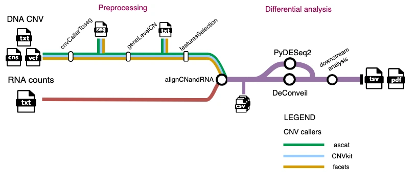

# CNawareDifferential

*CNawareDifferential* is a bioinformatic pipeline designed for Copy Number–aware Differential Gene Expression analysis.
It integrates DNA copy number (CN) profiles with bulk RNA-seq data to uncover expression changes that account for underlying genomic alterations.

### Overview

#### Input data

CNawareDifferential requires two main data types:

1) DNA Copy Number data (WGS/WES datasets from matched tumor–normal samples)
     - Supported formats: outputs from major CNV callers, including *ASCAT*, *CNVkit*, and *FACETS*.

2) Bulk RNA-seq count data

#### Key features

- **Preprocessing and alignment:**
harmonizes and aligns CN data with RNA-seq gene expression matrices to ensure consistent genomic mapping.

- **Differential Expression analysis:**
CN-naïve statistical test using *PyDESeq2*
CN-aware analysis using *DeConveil* to correct for CNV-driven effects in gene expression.

- **Downstream analysis:**
supports gene categorization and interpretation based on CN-aware differential expression outcomes.

